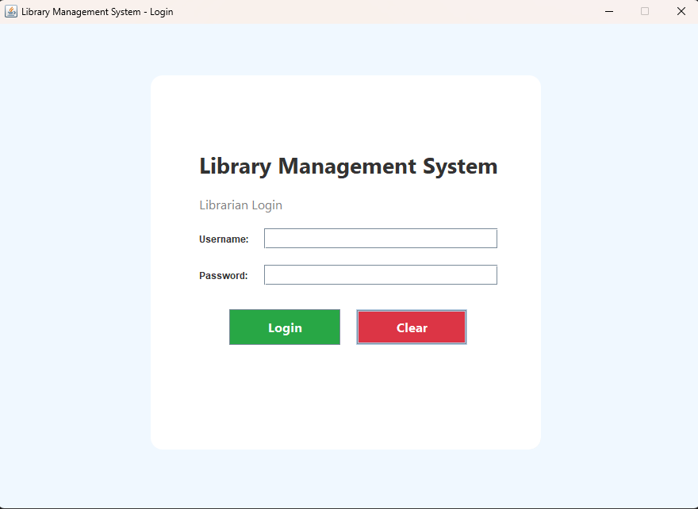
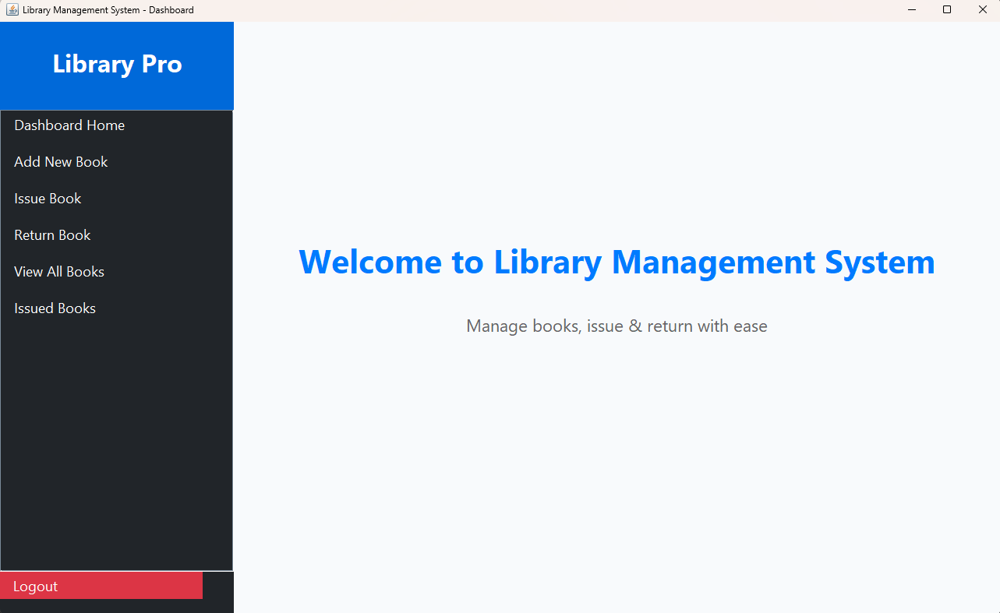
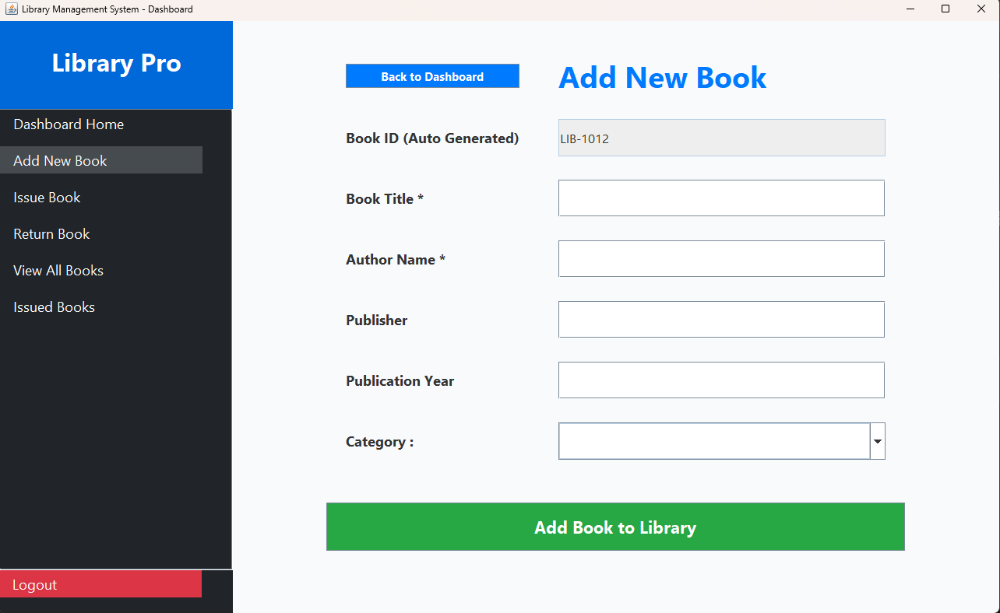

# 📚 Library Management System (Java Swing + MySQL)

A desktop-based **Library Management System** built using **Java (Swing)** for the user interface and **MySQL** for backend data storage.  
This system includes modules for book management, issuing/returning books, and librarian authentication.

---

## 📁 Project Structure

```js
├── .vscode/
├── bin/
├── lib/
│ └── mysql-connector-j-9.5.0.jar
└── src/
├── AddBookPage.java
├── BinBooksPage.java
├── DeleteBookPage.java
├── IssueBookPage.java
├── IssuedBooksPage.java
├── LibraryDashboard.java
├── LibraryLoginPage.java
├── ReturnBookPage.java
└── ViewAllBooksPage.java
```


---

## 🚀 Features

### 🔐 Authentication
- Secure librarian login system  
- Credentials validated through MySQL

### 📚 Book Management
- Add new books  
- Delete books  
- View all available books  
- Browse full inventory

### 📤 Issue & Return System
- Issue books to students  
- Return previously issued books  
- Track issued book history  
- View all issued books

---

## 🛠 Technologies Used

- **Java (Swing, AWT)**
- **MySQL Database**
- **JDBC (mysql-connector-j-9.5.0.jar)**  
- **MVC-based project structure**

---

## 🗄 Database Requirements

Create a MySQL database and required tables before running the application.

Example:

```js
-- ================================================
-- COMPLETE LIBRARY MANAGEMENT SYSTEM DATABASE
-- For Java Swing + MySQL Project
-- ================================================
CREATE DATABASE IF NOT EXISTS library_db;
USE library_db;
-- 1. Librarians Table (Login System)
CREATE TABLE librarians (
    id INT AUTO_INCREMENT PRIMARY KEY,
    username VARCHAR(50) UNIQUE NOT NULL,
    password VARCHAR(100) NOT NULL,
    full_name VARCHAR(100),
    phone VARCHAR(15),
    created_at TIMESTAMP DEFAULT CURRENT_TIMESTAMP
);
-- 2. Books Table (Main Library)
CREATE TABLE books (
    id INT AUTO_INCREMENT PRIMARY KEY,
    book_id VARCHAR(20) UNIQUE NOT NULL,
    title VARCHAR(300) NOT NULL,
    author VARCHAR(100) NOT NULL,
    publisher VARCHAR(100),
    year INT,
    category VARCHAR(50),
    available ENUM('Yes','No') DEFAULT 'Yes',
    issued_to_roll VARCHAR(50),
    issued_to_name VARCHAR(100),
    issue_date DATE,
    due_date DATE,
    created_at TIMESTAMP DEFAULT CURRENT_TIMESTAMP
);
-- 3. Issued Books History (Permanent Record + Fine)
CREATE TABLE issued_books (
    id INT AUTO_INCREMENT PRIMARY KEY,
    book_id VARCHAR(20) NOT NULL,
    book_title VARCHAR(300) NOT NULL,
    student_roll VARCHAR(50) NOT NULL,
    student_name VARCHAR(100) NOT NULL,
    issue_date DATE NOT NULL,
    due_date DATE NOT NULL,
    return_date DATE NULL,
    fine DECIMAL(8,2) DEFAULT 0.00,
    status ENUM('Issued','Returned','Overdue') DEFAULT 'Issued',
    returned_by VARCHAR(100),
    returned_on TIMESTAMP NULL
);
-- 4. Bin Table (Soft Deleted Books - Can be Restored)
CREATE TABLE bin_books (
    id INT AUTO_INCREMENT PRIMARY KEY,
    book_id VARCHAR(20) UNIQUE NOT NULL,
    title VARCHAR(300) NOT NULL,
    author VARCHAR(100) NOT NULL,
    publisher VARCHAR(100),
    year INT,
    category VARCHAR(50),
    deleted_at TIMESTAMP DEFAULT CURRENT_TIMESTAMP,
    deleted_by VARCHAR(100)
);
-- 5. Students Table (Optional - For Better Student Management)
CREATE TABLE students (
    id INT AUTO_INCREMENT PRIMARY KEY,
    roll_no VARCHAR(50) UNIQUE NOT NULL,
    full_name VARCHAR(100) NOT NULL,
    father_name VARCHAR(100),
    class VARCHAR(20),
    phone VARCHAR(15),
    address TEXT,
    photo LONGBLOB,
    registered_on TIMESTAMP DEFAULT CURRENT_TIMESTAMP
);
-- ================================================
-- INSERT DEFAULT DATA
-- ================================================
-- Default Admin Login (Username: admin, Password: admin123)
INSERT INTO librarians (username, password, full_name, phone) 
VALUES ('admin', 'admin123', 'Head Librarian', '9876543210');
-- Sample Books (Optional - For Testing)
INSERT INTO books (book_id, title, author, publisher, year, category) VALUES
('LIB-1001', 'Java Programming', 'James Gosling', 'Oracle Press', 2020, 'Technology'),
('LIB-1002', 'Data Structures', 'Thomas Cormen', 'MIT Press', 2009, 'Technology'),
('LIB-1003', 'To Kill a Mockingbird', 'Harper Lee', 'J.B. Lippincott', 1960, 'Fiction'),
('LIB-1004', '1984', 'George Orwell', 'Secker & Warburg', 1949, 'Fiction'),
('LIB-1005', 'The Great Gatsby', 'F. Scott Fitzgerald', 'Scribner', 1925, 'Fiction');
-- Sample Students (Optional)
INSERT INTO students (roll_no, full_name, father_name, class, phone) VALUES
('STU001', 'Rahul Sharma', 'Mohan Sharma', 'Class 12', '9876543210'),
('STU002', 'Priya Singh', 'Rajesh Singh', 'Class 11', '8765432109'),
('STU003', 'Amit Kumar', 'Suresh Kumar', 'Class 10', '7654321098');
-- ================================================
-- INDEXES (For Faster Search)
-- ================================================
CREATE INDEX idx_book_id ON books(book_id);
CREATE INDEX idx_title ON books(title);
CREATE INDEX idx_author ON books(author);
CREATE INDEX idx_student_roll ON students(roll_no);
CREATE INDEX idx_issued_book ON issued_books(book_id);
CREATE INDEX idx_bin_book ON bin_books(book_id);
```

## ▶️ How to Run the Project

1. Install **JDK 8+**
2. Install and start **MySQL Server**
3. Import **mysql-connector-j-9.5.0.jar** into project libraries
4. Update database credentials in your Java code (if required)
5. Compile and run the project:

```bash
javac -cp "lib/mysql-connector-j-9.5.0.jar" src/*.java
java -cp "bin;lib/mysql-connector-j-9.5.0.jar" LibraryLoginPage 
```

## 📸 Screens (Optional)

You can include screenshots here after running the UI:





---

## 📄 License

This project is for educational and academic use.

---

## 👤 Author

**Your Name**  

Sudhanshu Kumar